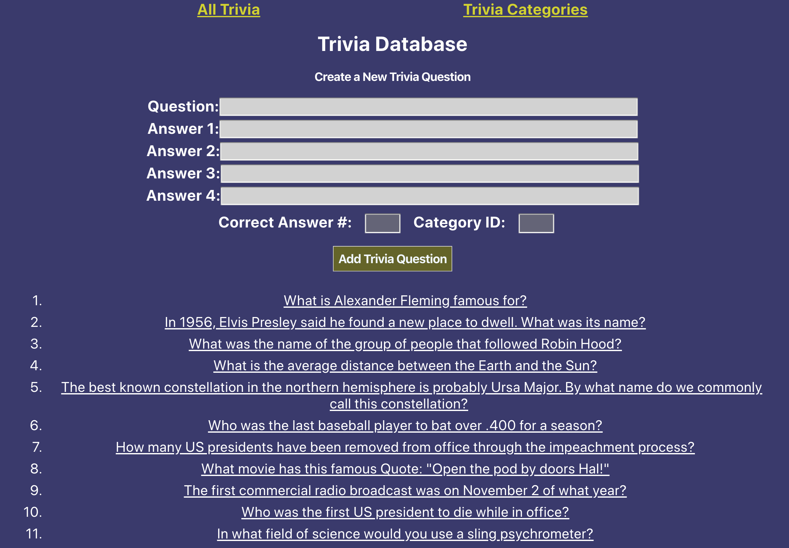
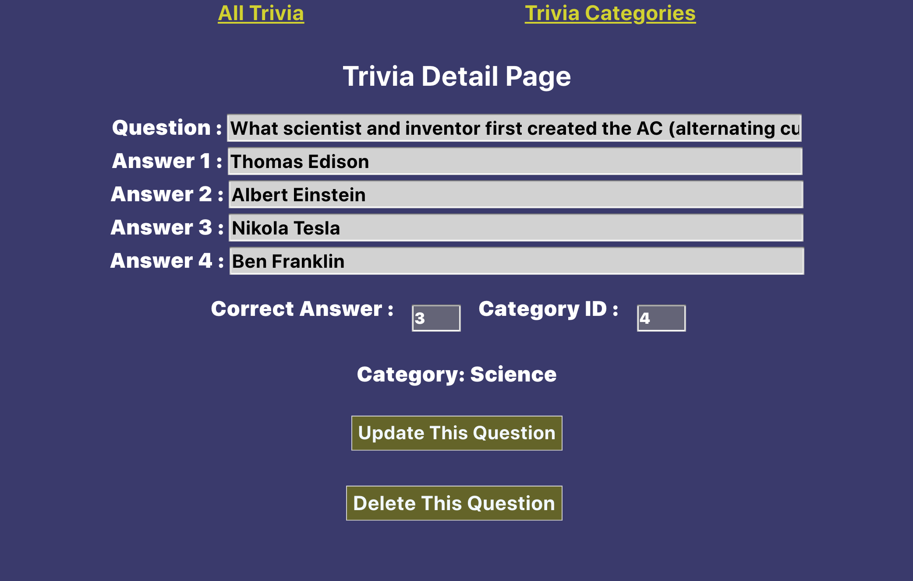
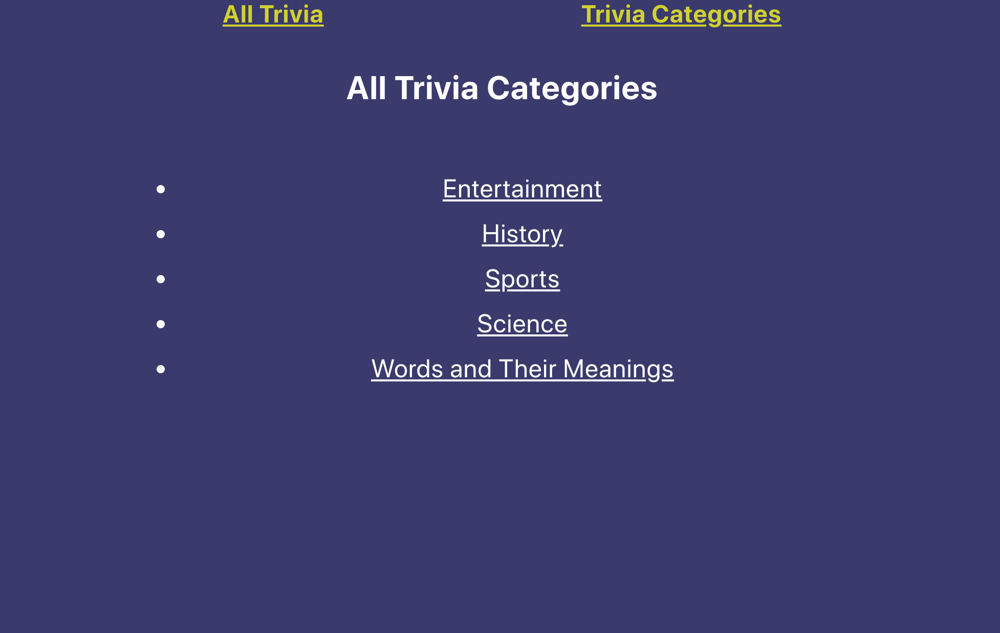

## Project 4 Trivia Database Frontend Application

## Application Description

This application is the front-end interface to the back-end Express application which access the data on the Trivia Database. It enables a user to create a trivia question along with 4 possible answers, including a field to indicate the correct answer. It also enables the user to assign each trivia question to a specific trivia category.

This React App interfaces between the user and the backend application.

### User Stories

1. The application needs to give users access to the Trivia database which can be used in a multiple choice trivia game.
2. The application needs to enable the user to view a list of trivia questions.
3. While viewing the list of trivia questions, the user should be able to click on a question to view all the possible answers regarding that specific trivia question.
4. While viewing the trivia question, the user should have the option to edit and update the question.
5. Users also need to be able to add a new trivia question.
6. All trivia questions can be assigned to a trivia category.
7. The user should have the ability to delete a specified trivia question.
8. User needs to be able to see the list of Categories to which the trivia questions can be assigned.

### Technical Requirements

1. This application uses React to create the components for the frontend to be used by the users to interface with the backend application.
2. The backend application uses an express node.js backend framework and RESTful routes to interface with the database.
3. Both applications work together as a full stack application to enable the full range of activities for the user.
4. The trivia data is stored on a relational database.
5. The programs are primarily written in Javascript using XML and CSS code to create the views for the user.
6. It is deployed on Heroku.
7. There is a many-to-one relationship between the trivia questions and the categories.
8. This project was bootstrapped with [Create React App](https://github.com/facebook/create-react-app).

**The application is hosted on https://dashboard.heroku.com/apps/trivia-react-frontend and saved to https://github.com/jeff61b/Project4**

## Available Scripts
